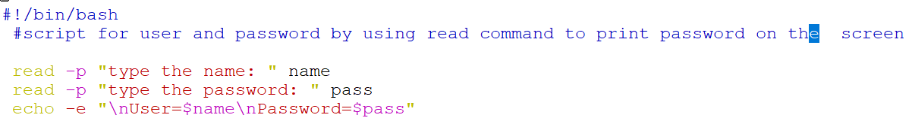
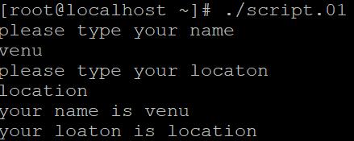
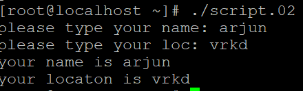
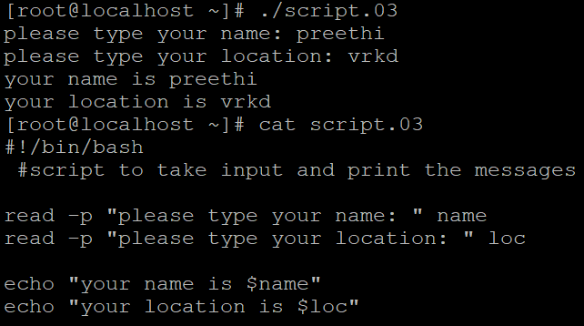
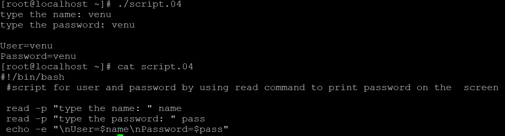
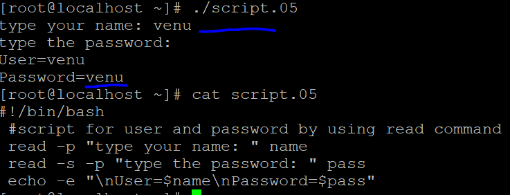
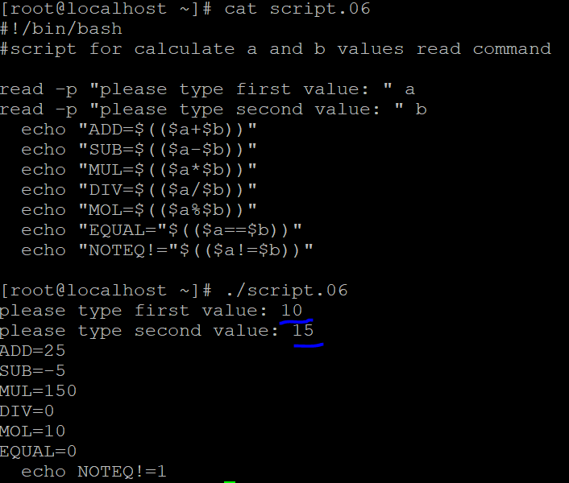
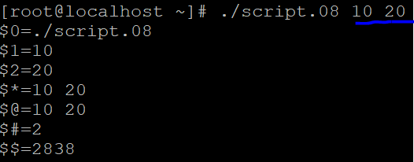
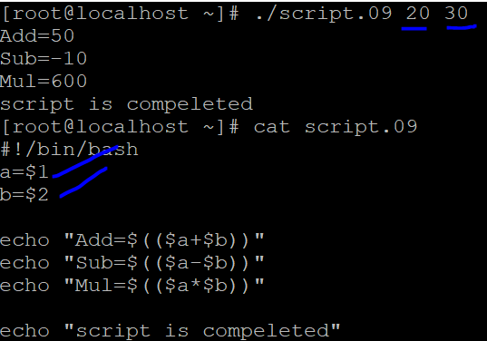

## Arrays
---------------
* Script for user name and assign a password by using `read-command` while typing the password printing on the sreen
* SheBang
 ```
 emp[0]=john
 emp[1]=jhone
 emp[2]=ali

 echo ${emp[0]}
 echo ${emp[1]}
 echo ${emp[*]}=>all employes
 echo ${emp[@]}=>all employes
 echo ${#emp[*]}=>total number of employes
 ``` 
 
 ```
 #!/bin/bash
 read -p "type your name: " name
 read -p "type your password: " pass
 echo -e "\nUser=\name\nPassword=$pass"
 wq!
 chmod +x script.s 
 ```
 

* script for to take user and location by using read command
 ```
 echo "please type your name"
 read name
 echo "please type your location"
 read loc
 echo "your name is $name"
 echo "your location $loc"
 wq!
 ```
  

* script to create one line for user information
 ```
 #!/bin/bash
 echo -n "please type your name: "
 read name
 echo -n "please type your location: "
 read loc
 echo "your name is $name"
 echo "your name is $loc"
 wq!
 ```
 

* script for user information by using read command
 ```
 #!/bin/bash
 read -p "type your name: "
 read -p "type your loc: "
 echo "your name is $name"
 echo "your name is $loc"
 ``` 
 

* script for user name and password
```
read -p "type your name: " name
read -p "type your password: " pass
echo -e "\nUser=$name\npassword=$pass"
``` 


* script for user name and password (password not printing)
 ```
 read -p "type your name: " name
 read -s -p "type your password: " pass
 echo -e "\nUser=\nname\npassword=$pass"
 s--> security 
 ```
 
* script for mathemaic calculation 
  ```
  #!/bin/bash
  read -p "type first value: " a
  read -p "type secound value " b
  echo "Add=$(($a+$b))"
  echo "sub=$(($a-$b))"
  echo "mul=$(($a*$b))"
  wq!
  ```
  

### Special variales
* special variale 
 ```
 #!/bin/bash

echo '$0='$0
echo '$1='$1
echo '$2='$2
echo '$*='$*
echo '$@='$@
echo '$#='$#
echo '$$='$$
 wq!
 ```
 

* script for calculate taking input by using special variable
 ```
 #!/bin/bash
 a=$1
 b=$2
 echo "Add=$(($a+$b))"
 echo "Sub=$(($a-$b))"
 echo "Mul=$(($a*$b))"
 wq!
 ``` 
 


