### FUNCTIONS:
* Functions are set of commands in side a fuction
   ```
   venu()
   {
      date
      pwd
      ps   
      uptime
   }
   venu <press_enter>
  ```
* if we use any type of shell,function name didn't execute
* if we exit the shell function name should be work
* if we use any type of shell,after then we excute `export -f` function can be working
  ```
  export -f <function_name>
  ```
* if we remove the fuction `unset -f` function didn't work 
   ```
   unset -f <function_name>
   ``` 
* create a function with name as _func_ 
  ```
  func()
  {
    ps
    date
    netstat -ntlp
  }
  ```  
 * after create a function we execute the command
  ```
  export -f <function_name>
  ``` 
* after than when see the function input details 
  ```
  type <function_name>
  ```  
 * add the function permanently
  vim .bash_profiles
 ```
     venu is a function
   venu ()
   {
       date
       free -m;
       vmstat;
       lscpu
   }
 ```  
    export -f venu

* create a new script with command line

* check the last number used in sequence
* create a new file with next number
* add shebang to the file
* add comment line in the file
* open the file in vim editor
* should apply execute permission and display information
  

* example:  script.09
  
  script()
  {
 
* ls -1 script* |tail -1
* ls -1 script* |tail -1 |sed -e 's/script//' |sed -e 's/.//'
* i=`ls -1 script* |tail -1 |sed -e 's/script//' |sed -e 's/.//'`
* i=$(($i+1))
* echo '#!/bin/bash' >script$i.sh
* echo 'script for ' >>script$.
* vim script$.sh
* chmod +x script$.sh 
* ls -l script$.sh
  }
  
  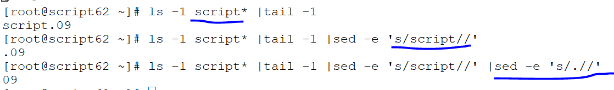

* script for calculating mathematics by using functons
  
```
  #!/bin/bash
##script for calculating

cal()
{
        echo "Add=$(($a+$b))"
        echo "SUB=$(($a-$b))"
        echo "MUL=$(($a*$b))"
        echo "DIV=$(($a/$b))"
}

  read -p  "please type your a value: " a
  read -p  "please type your b value: " b
  cal
  echo "script is completed succssfully"
 ```
 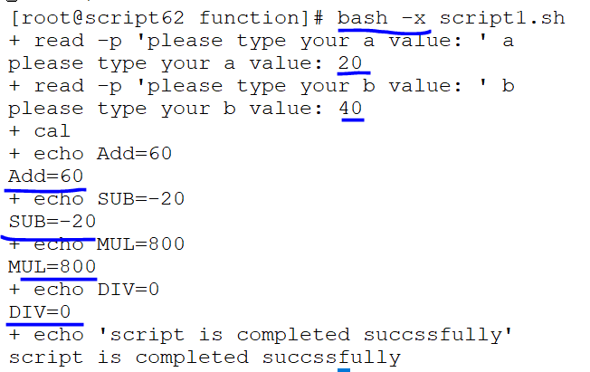
 ```
#!/bin/bash
## script for calculating a and b value

func()
{
        echo "Add=$(($a+$b))"
        echo "Sub=$(($a-$b))"
        return
        echo "Mul=$(($a*$b))"
        echo "Div=$(($a/$b))"
}

  read -p "please type your a value: " a
  read -p "please type your b value: " b
  func
  
  echo "script is completed"
 ```
 return is stop the command in betwween remaining task should be execute by close the function bracket
 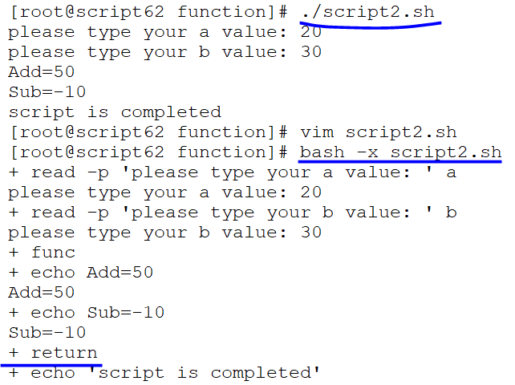

 #### CASE-STATEMENT:

* ```
     #!/bin/bash
   ##Script for case statement
   read -p "please select an os [UNIX|LINUX]: " OS
   case $OS in
           UNIX)date ;;
           LINUX)fdisk -l ;;
   esac
   
  ```
 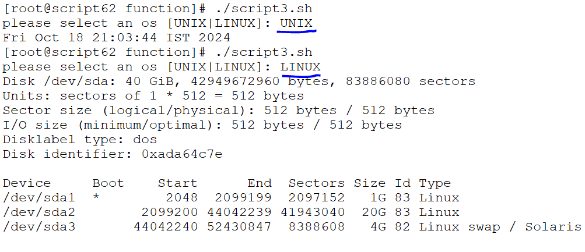

* script for still exiting 
 ```
 #!/bin/bash
##script for case-statement
calc()
{
read -p "selct your [ADD|SUB|MUL|DIV|EXIT]: " op
case $op in
        ADD)echo "Add=$(($a+$b))" ;;
        SUB)echo "Sub=$(($a-$b))" ;;
        MUL)echo "Mul=$(($a*$b))" ;;
        DIV)echo "Div=$(($a/$b))" ;;
        EXIT)echo -e "\e[33m invalid\e[0m"
        exit ;;
        *)echo -e "\e[32m check operator \e[0m" ;;

esac
calc
}

read -p "type a value: " a
read -p "type b value: " b
calc
 ``` 
 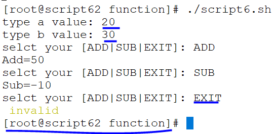

* script for type any add/sub/ auto exit
 
  ```
  #!/bin/bash
  ##Script for case-statement
  calc()
  {
  read -p "select your choice[ADD|SUB|MUL|DIV]: " op
  
  case $op in
                  ADD)echo "Add=$(($a+$b))" ;;
                  SUB)echo "Sub=$(($a-$b))" ;;
                  MUL)echo "Mul=$(($a*$b))" ;;
                  DIV)echo "Div=$(($a/$b))" ;;
                  *)echo -e "\033[34m invaild \033[0m" ;;
  esac
  }
                    read -p "type a value: " a
                    read -p "type b value: " b
  
  calc
  ```

 ```
  #!/bin/bash
calc()
{
        read -p "please select an operator [ADD|SUB|MUL|DIV]: " op
        case $op in

                ADD)echo "Add=$(($a+$b))" ;;
                SUB)echo "Sub=$(($a-$b))" ;;
                MUL)echo "Mul=$(($a*$b))" ;;
                DIV)echo "Div=$(($a/$b))" ;;

        esac
calc
}

read -p "a value: " a
read -p "b value: " b
calc

  ```
 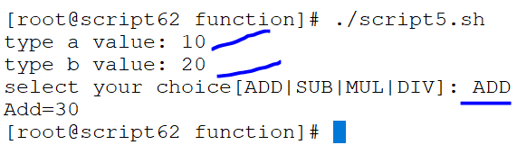

### IF-STATEMENT:
* simple -if
  ```
  -e
  Check if a file is a regular file
  -n
  Check if two strings are equal
  -f
  Check if a file is a directory
  -z
  Check if a string is not empty
  -d
  Check if a string is empty
  -r
  check if file is regular
  ```
* test -e /etc/passwd
  echo ?
* test -r /etc/passwd
  echo $?
* test -s /etc/passwd
  echo $? 

 * script for simple-if statement
   
   ```
   #!/bin/bash
   read -p "plz type valid command: " file
   fi
   [ -e $file ];
   then
   echo "file exist"
   else
   echo "file doesn't exist"
   fi
   ```
   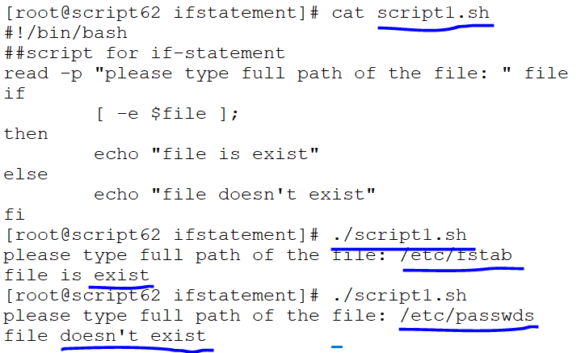 

 * string test {-z -e -n -f -s -r}
  
  ```
  var='/etc/fstab'
    [ -z "$var"]
    echo $?
    [ -r "$var"]
    echo $?
    [ -n "$var"]
    echo $?
    [ -e "$var"]
    echo $?
    [ -s "$var"]
    echo $?
 ```  
  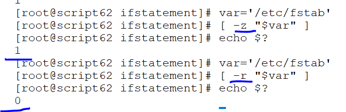
  

### IF-ELSE 
* script for to use if-else-fi
  
```
#!/bin/bash
##script for to use if-else statement
read -p "please type full of the file: " file
    if
            [ -z "$file" ];
    then
            echo "invalid file"
            exit
    fi
    
    if
             [ -r "$file" ];
     then
             echo "file is exist"
     else
             echo "file is doesn't exists"
    fi
    
    if
             [ -e "$file" ];
     then
             echo "file is correct"
     else
             echo "file is incorrect"
     fi
  ```
  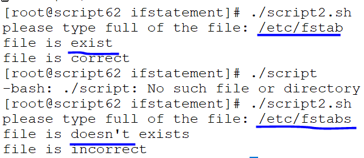 
* script:2
 ```
#!/bin/bash
#script for cal mathematics by if-statement
calc()
{
        read -p "select an operator [ADD|SUB|MUL|DIV]: " op
        case $op in

                ADD) echo "Add=$(($a+$b))" ;;
                SUB) echo "Sub=$(($a-$b))" ;;
                MUL) echo "Mul=$(($a*$b))" ;;
                DIV) echo "Div=$(($a/$b))" ;;
                *) echo -e "\e[32m invalid operator \e[0m"
        esac

}
read -p "first value: " a
if [ -z "$a" ];
then
        echo "invalid input"
fi

if [ -e $a ];
then
        echo "valid input"
fi

read -p "secound value: " b
if [ -z "$b" ];
then
        echo "invalid input"
fi

if [ -e $b ];
then
        echo "valid input"
fi
calc

```
chmod +x script04.sh
./script04.sh

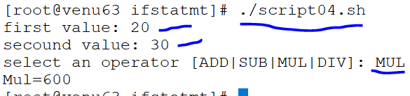

 ```
#!/bin/bash
#script for mathametics by using function and if-statement

calc()
{
        read -p "operator [ADD|SUB|MUL|DIV]: " op
        if [ "$op"="$ADD" ];
        then
                echo "Add=$(($a+$b))"
        fi


         if [ "$op"="$SUB" ];
        then
                echo "Sub=$(($a-$b))"
        fi


         if [ "$op"="$MUL" ];
        then
                echo "Mul=$(($a*$b))"
        fi

         if [ "$op"="$DIV" ];
        then
                echo "Div=$(($a/$b))"
        fi

         echo -e "\e[32m check an operator \e[0m"

}


read -p " a value: " a
if [ -z "$a" ];
then
        echo "invalid input"
fi

if [ -e "$a" ];
then
        echo "valid input"
fi


read -p " b value: " b
if [ -z "$b" ];
then
        echo "invalid input"
fi

if [ -e "$b" ];
then
        echo "valid input"
fi
calc

```
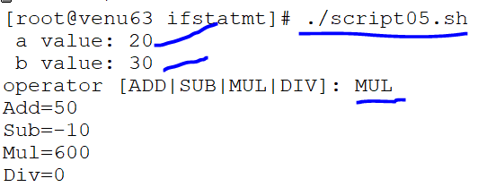

* script for start and stop the service

* script for start the service
 
 ```
#!/bin/bash
#script for start the service
ser=`systemctl is-active nfs-server.service`

if [ "$ser" = "active" ] ;
then
        echo "nfs-server.server is running"

else
        echo "nfs-server.service is not running"

        read -p "start vsftpd-server.service server [Y/N]: " op

        if [ "$op" = "Y" ] ;
        then
                systemctl start nfs-server.service
        fi

fi

 ```

* script for stop the service

 ```
  #!/bin/bash
#script for start the service
ser=`systemctl is-disabled nfs-server.service`

if [ "$ser" = "disabled" ] ;
then
        echo "nfs-server.server is running"

else
        echo "nfs-server.service is not running"

        read -p "start vsftpd-server.service server [Y/N]: " op

        if [ "$op" = "N" ] ;
        then
                systemctl stop nfs-server.service
        fi

fi

 ```
### ELIF-LADER

 ```
 #!/bin/bash
#script for elif-ladder

calc()
{
        read -p "calculating the operator [ADD|SUB|MUL|DIV|EXIT]: " op

        if [ "$op" = "ADD" ];
        then
                echo "Add=$(($a+$b))"

        elif [ "$op" = "SUB" ];
        then
                echo "Sub=$(($a-$b))"

        elif [ "$op" = "MUL" ];
        then
                echo "Mul=$(($a*$b))"


        elif [ "$op" = "DIV" ];
        then
                echo "Div=$(($a/$b))"

        elif [ "$op" = "EXIT" ];
        then

                echo -e "\e[32m existing the script \e[0m"

                exit
        else
                echo -e "\e[33m invalid operator \e[0m"


fi

calc
}

read -p "a value " a
if [ -z "$a" ] ;
then
        echo "invalid  a value"
fi

read -p "b value " b
if [ -z "$b" ] ;
then
        echo "invalid b value"
fi
calc
 ```
* Numerical comparision:
  
  ```
  eq=>equal to (=)
  ne=>not equal  (≠) 
  gt=>greaterthan (>)
  ge=>greaterthan (>=)
  lt=>less than (<)
  le=>less than  (<≠) 
 

   [ 10 -eq 11 ]
   echo $?

   [ 10 -ne 11 ]
   echo $?

   [ 10 -gt 11 ]
   echo $?

   [ 10 -ge 11 ]
   echo $?

   [ 10 -lt 11 ]
    echo $?

   [ 10 -le 11 ]
   echo $?
  
   ```
#### Compound experssion:  
* taking two values and evaluate at a time
* mixing two values at a time
* logic gates `AND,OR`
* 0-->true
* 1-->false
 
  if [ -z "$a" -o "$b" ];
  then
  fi
 
 ```
 AND (A*B)                                OR (A+B)
 -----------------------------------------------------
 A	B	Y               A  	   B	   Y
 -----------------            ------------------------
 0	0	0               0          0       0
 0	1	0               0          1       1
 1	0	0               1          0       1
 1	1	1               1          1       1
 
 ```

* script for compound experssion by using function

 ```
 #!/bin/bash
#script for compound expression

calc()
{
        read -p "type the operator [ADD|SUB|MUL|DIV]: " op

        if [ "$op" = "ADD" ];
        then
                echo "Add=$(($a+$b))"

        elif [ "$op" = "SUB" ];
        then
                echo "Sub=$(($a-$b))"

        elif [ "$op" = "MUL" ];
        then
                echo "Sub=$(($a*$b))"

        elif
                [ "$op" = "DIV" ];
        then
                echo "Div=$(($a/$b))"


        else
                echo -e "\e[34m invalid operator\e[0m"
        fi
calc
}


   read -p "first a value: " a
   read -p "secound b value: " b
   
   if [ -z "$a" -o "$b" ];
   then
           echo "invalid input"
   fi
   calc
  ```

* script for ip-addresses pinging

  ```
     #!/bin/bash
   #script for checking ip-addresses
   
   read -p "type the ip : " ip
   ping -c4 $ip &>/dev/null
   
   if [ $? -eq 0 ];
   then
           echo "$ip is pinging"
   else
           echo "ip is not pinging"
   
   fi

  ```
* bash -x scriptxx.x

 0=>is pinging
 1=>is not pinging
 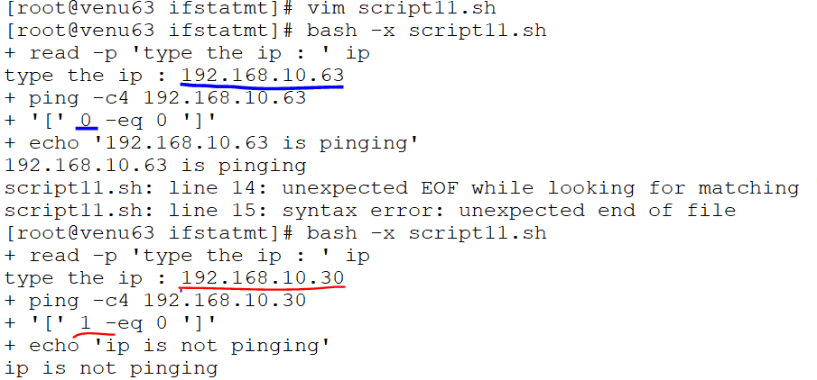  


  


 