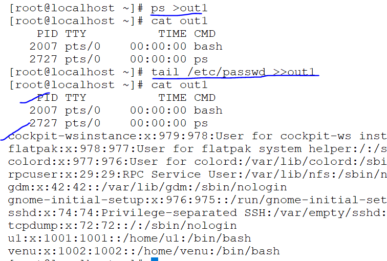

### QUOTES

* single quote:
  ```
   [root@localhost ~]# echo 'hello'
  hello
  [root@localhost ~]# echo 'hello world'
  hello world
  ```
* double quotes:
   ```
     [root@localhost ~]# echo "hello world"
   hello world
   [root@localhost ~]# echo "testing
   testing
  ```
  

### I/O RE-DIRECCTION  >,>>,&
 

#### Mail
* mail sending to the user's
 ```
 mail -s u1 sample < mail.txt
 ``` 
### static codes
* if command is correct `0` if not correct the command `1-255` in between generate any number

*  ```
   0-255
   0-->successful
   1-255
   1-->failure
   ```
*  ```
   [root@localhost ~]# ps
    PID TTY          TIME CMD
   2007 pts/0    00:00:00 bash
   3290 pts/0    00:00:00 ps
   [root@localhost ~]# echo $?
   0
   [root@localhost ~]# pss
   bash: pss: command not found...
   Similar command is: 'ps'
   [root@localhost ~]# echo $?
   127
   ```

### file filter commands: 
  ```
  head
  tail
  grep
  xargs
  cut
  sed
  sort
  less
  more
  ```
1. Based on line numbers: (head and tail)

* cat -n /etc/passwd 
* cat -n /etc/passwd |head
* cat -n /etc/passwd |tail
  
* cat /etc/passwd |head -10 |tail -4  
     

2. Based on rows (grep-command) 
   
  ```
  grep root /etc/passwd
  grep -n root /etc/passwd
  grep -n root /etc/passwd /etc/shadow
  grep -n -e root -e sshd -e ftp /etc/passwd
  grep -n -E 'root|adm|sshd|ftp|nobody' /etc/passwd
  ```   
* search word in the file and compare to another file

  cat test.sh 

  grep -n root test.sh /etc/passwd
  
  ``` 
   test.sh:6:root
   /etc/passwd:1:root:x:0:0:root:/root:/bin/bash
   /etc/passwd:10:operator:x:11:0:operator:/root:/sbin/nologin 
  ```
  
* if a word in capital/small letters in a file  

  grep -i date <file_name>
  ```
  [root@venu62 ~]# grep -i date test.sh
     Date
    i-->case insensitive
  ```
* search and hide the word in a file and print the o/p

*  grep -iv  word <file_name>
   ```
   [root@venu62 ~]# cat test.sh
    whoami
    pwd
    Date
    vmstat
    parted -l
    root
    ftp
    
    [root@venu62 ~]# grep -iv pwd test.sh
    whoami
    Date
    vmstat
    parted -l
    root
    ftp
   ```  
* word begining of the line `^` word ending of the line `$`
  ```
  .grep -n'^$' /etc/passwd (any file name)   
  grep  ^root /etc/passwd 
  grep  bash$ /etc/passwd
  ^ --> search the word for starting
  $ --> search the word for ending
  ```  
  

* finding the empty lines and re-arrange the gap covered the line
 ```
  grep -v '^$' <file_name>
  grep -iv '^$' <file_name>
  ```
  
  

  
3.  Based on columns (cut-command):

  ```
  delimeter (d): . , $#@
  tail -5 /etc/passwd |cut -d: -f1
  tail -5 /etc/passwd |cut -d: -f1,3
  ```
*  ```
   cat -n /etc/shadow |tail -10
   ```
   
* field separator 
  

* irregular spaces to convert regular space by using `xargs` command
  ```
  free -m |grep -Mem|xargs|cut -d ' ' -f1
  ```
  

#### AWK Command:
* cut the o/p into columns
    
  ```
  .it can be handle any type of irregular spaces
  .compare to grep,xarg,cut commands only works with one command `awk` 
  .field separator line : ; . , $ # @ -f
  field/colcumns $ ($1,$2,$3....$NF)
  ```
 * it can be handle any type of irregular spaces

   ```
   free -m
   $1,$2...$NF
   $1-->first field
   $NF-->nth field
   ``` 
   
*  field separator line : ; . , $ # @ -F
   
   
   
   
   ```
   . cat /etc/passwd |tail -5
   . cat /etc/passwd |tail -5 |grep -i gnome
      gnome-initial-setup:x:976:975::/run/gnome-initial-setup/:/sbin/nologin
   . cat /etc/passwd |tail -5 |grep -i gnome |cut -d: -f1
   . cat /etc/passwd |tail -5 |grep -i gnome |awk -F:         '  {print $2,$NF}'
      x /sbin/nologin

   ```
    
   ```
   .difference between cut and awk command fields represanted by
    .cut:-f1,-f2
    .awk:$1,$2..$NF
     cut-->(cut -d: -f1..)
     awk-->(awk -F: '{print $1...$nf}')
   ```


 