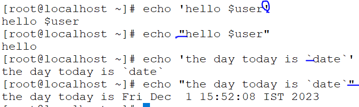

### QUOTES
 1.Single quote(' ')
 2.double quote(" ")

* 1.single quote:(' ')
 .nothing but strict quote

 ```
 .echo single quote
   single quote
 .echo 'single quote'
   single quote
 ```
* 2.double quotes:(" ")
   
   ```
  .echo quotes
    quotes
  .echo "double quotes"
    double quotes
  ```
* Single and double quotes are giving same result

#### Variables
* Variables is nothing but set of data can be insided
 ```
 .echo whoami $USER
   whoami root

 .echo 'whoami $USER'
   whoami $USER
 .echo "whoami $USER"

   whoami root
 .when use $ sysmbol we use double qoutes " "
  .echo 'date is `date`'

  .echo "date is `date`"
   date is Sun Oct  6 22:58:34 IST 2024
 ```
* (' ')single quote: generated same assumption
* (" ")double quote:generated into can be new assumption

  

#### I/O RE-DIRECCTION  >,>>,&>

* i/o re-direction means append date into old files to new files
* capture the output from the file
  >:capture the input file and into output file <new_file> but only one command can be capture(>)

* >>:capturing the both files at once i.e;append the date mutliple file(>>) 

* &>:working commands/scripts can be display and at a time and not display not working command/scripts and also can be display

 

 ```
 2>&1 will be existing file and non-existing file capatue both at a time into a file

 ls -l script02.sh scriptx.sh 2>&1 out1
 ```

#### Mail
  * <:stdin(standard input)
* mail sending to the user's
 ```
 mail -s u1 sample < mail.txt
 ``` 
### static codes (0-255)
* if command is correct '0' is successful
* if command is not correct in between generate a number (1-255) is failure

*  ```
   0-255
   0-->successful
   1-255
   1-->failure
   ```

*  ```
   .ps
     PID TTY          TIME CMD
     2007 pts/0    00:00:00 bash
     3290 pts/0    00:00:00 ps
   
   .echo $?
     0

    .pss
     bash: pss: command not found...
     Similar command is: 'ps'

    .echo $?
     127
   ```
* /dev/null:nothing but hide the output,but command is correct
  
  ```
  . ps &>/dev/null
  . echo $?
    0
  .cat /dev/null
  
  ```   

### file filter commands: 
  ```
  head
  tail
  grep
  xargs
  cut
  sed
  sort
  less
  more
  ```
1. Based on line numbers: (head and tail)

* cat -n /etc/passwd 
* cat -n /etc/passwd |head
* cat -n /etc/passwd |tail
  
* cat /etc/passwd |head -10 |tail -4  
     

### Grep-comand (based on rows)
* search word in the file and compare to another file
   
  ```
  grep root /etc/passwd
  grep -n root /etc/passwd
  grep -n root /etc/passwd /etc/shadow
  grep -n -e root -e sshd -e ftp /etc/passwd
  grep -n -E 'root|adm|sshd|ftp|nobody' /etc/passwd
  ```   

 
  
* if a word in capital/small letters in a file  
 
 ```
  grep -i date <file_name>
  i:case insensitive
  grep -iv  word <file_name
  v:hide the word and total remove that line
 ``` 
### ^,$  
* word begining of the line `^` word ending of the line `$`
  
  ```
  [root@localhost ~]# tail /etc/passwd |grep ^venu
  venu:x:1000:1000:venu:/home/venu:/bin/bash
  [root@localhost ~]# tail /etc/passwd |grep  bash$
  venu:x:1000:1000:venu:/home/venu:/bin/bash
  preethi:x:1001:1001::/home/preethi:/bin/bash
  [root@localhost ~]#
  ```  
  

* finding the empty lines and re-arrange the gap covered the line
 ```
  grep -v '^$' <file_name>
  grep -iv '^$' <file_name>
  ```
  
  

  
3.  Based on columns `cut-command`:

  ```
  delimeter (d): . , $#@
  tail -5 /etc/passwd |cut -d: -f1
  tail -5 /etc/passwd |cut -d: -f1,3
  ```
*  ```
   cat -n /etc/shadow |tail -10
   ```
   
* field separator 
  

* irregular spaces to convert regular space by using `xargs` command

  ```
  free -m |grep -Mem|xargs|cut -d' ' -f1
  cat /etc/selinux/config |grep -i selinux |cut -d' ' -f1
  cat /etc/selinux/config |grep -i selinux |cut -d' ' -f1,2
  ```
* `Xargs-command`is used for when irregular spaces in file   
  

#### AWK Command:
* irregular spaces can be split into one word by using commands `xargs,cut` but can be  manage only one command `awk`
* cut the o/p into columns
    
  ```
  .it can be handle any type of irregular spaces
  .compare to grep,xarg,cut commands only works with one command `awk` 
  .field separator line : ; . , $ # @ -f
   field/colcumns $ ($1,$2,$3....$NF)
  ```
 * it can be handle any type of irregular spaces

   ```
   free -m
   $1,$2...$NF
   $1-->first field
   $NF-->nth field
   ``` 
   

*  field separator line : ; . , $ # @ -F

   
   
   
   
  
   ```
   . cat /etc/passwd |tail -5
   . cat /etc/passwd |tail -5 |grep -i gnome
      gnome-initial-setup:x:976:975::/run/gnome-initial-setup/:/sbin/nologin
   . cat /etc/passwd |tail -5 |grep -i gnome |cut -d: -f1
   . cat /etc/passwd |tail -5 |grep -i gnome |awk -F:  '{print $2,$NF}'
      x /sbin/nologin
   .cat /etc/selinux/config |awk '/SELINUX/{print$2}'
   .cat /etc/selinux/config |awk '/SELINUX/{print$3,$NF}'

   ```
    

   
   ```
    .difference between cut and awk command fields represanted by
    .cut:-f1,-f2
    .awk:$1,$2..$NF
     cut-->(cut -d: -f1..) 
     awk-->(awk -F: '{print $1...$nf}')
   ```


 