### SED COMMAND:

* to print line number from a file by using `sed` command
  ```
  cat -n /etc/passwd |sed -n '10,15 p'
  ```
  
* to print odd numbers in a file
  ```
  cat -n /etc/passwd |head -10 |sed -n '/1~2 p'
  ```  
  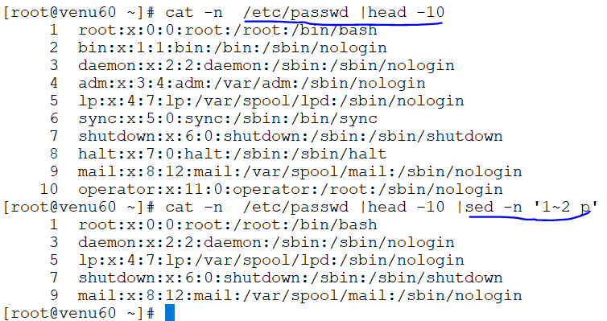
* to print even numbers from a file   
  ```
  cat -n /etc/passwd |head -10 |sed -n '2~2 p'
  ```
  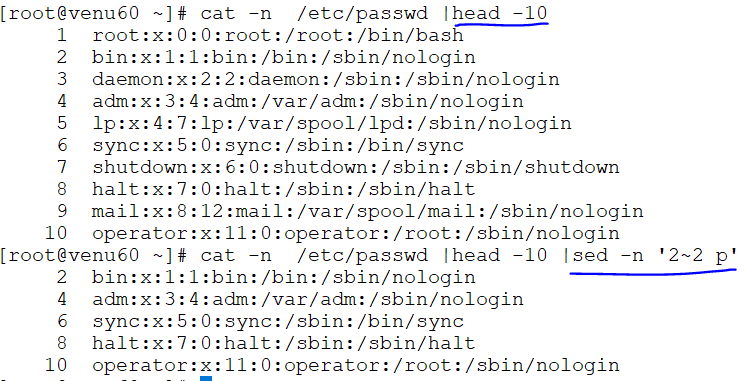
* to delete a lines from a file
  ```
  cat -n /etc/passwd |head -10 |sed '2 d'
  cat -n /etc/passwd |head -10 |sed '2 d'
  ```  
  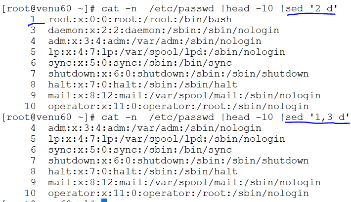
* to delete a 2nd to last line 
  ```
  cat -n /etc/passwd |head -10 |sed '2 $d'
  ```  
  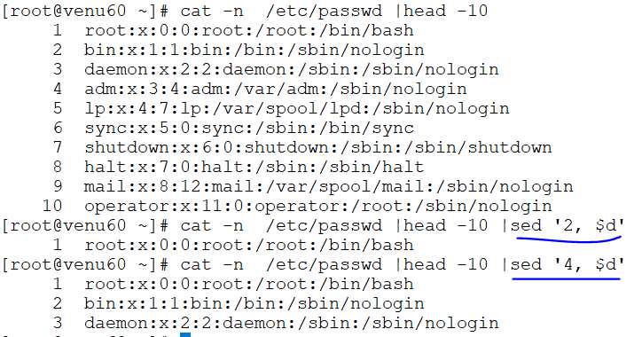
* to delete a word in file
  ```
  cat -n /etc/passwd |tail -10 |sed '/jonny/ d'
  ```  
  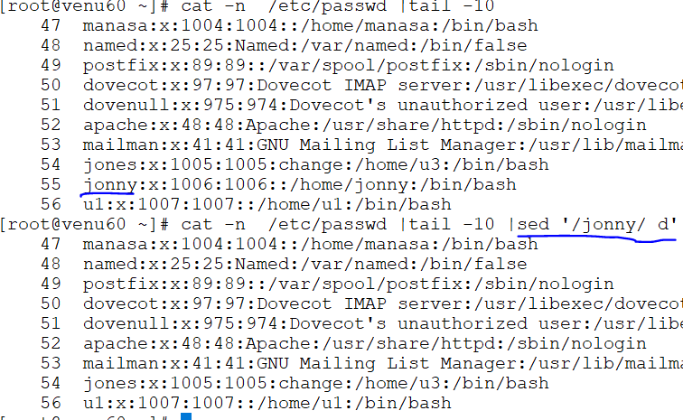
* to change the name old-name to new-name
  ```
  cat -n /etc/passwd |tail -10 |sed 's/jonny/venu/'
  ```  
  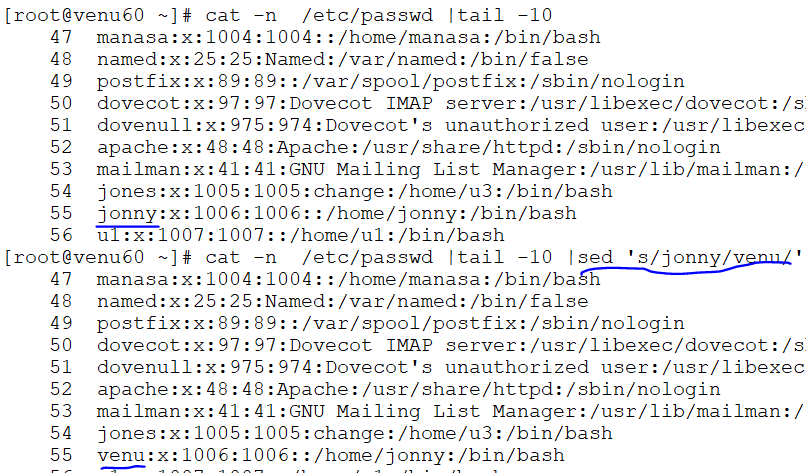
* if a word capital/small letters
  ```
  echo apple ant |sed -e 's/A/a/g'
  ```
* to change the name whole file as a same name
  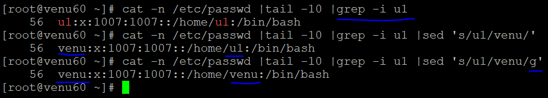

### To editing configuration files by using `sed` command

* committed and un-committed lines

* cat /shells/sshd.config |grep -i dns
 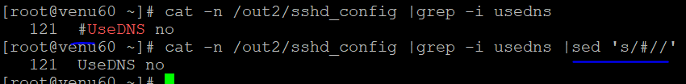
* in conf file have a single word we can be search use this `sed '/UseDNS/`
* can be replace `yes/no`
 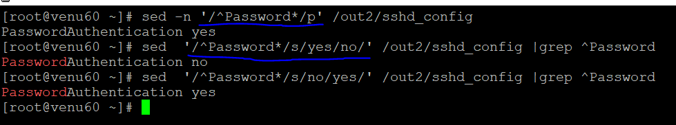 `sed /UseDNS/s/yes/no/` 
* To un-commited line 
 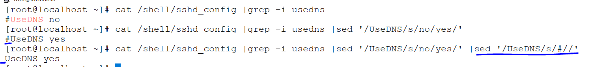
* if a single word number of lines can be formed
 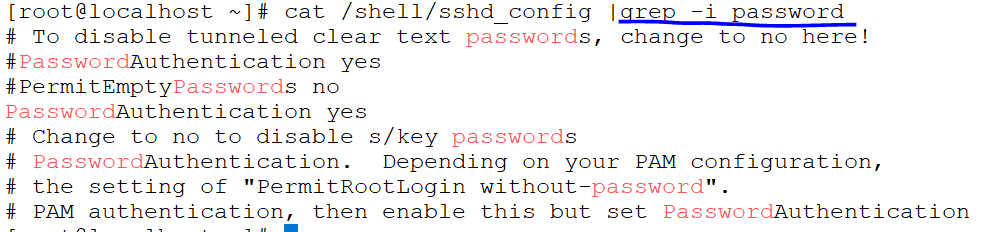
* if we use `sed  /^Password*/p`
 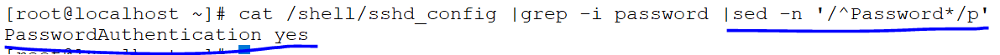  
*  if PasswordAuthentication yes  `sed '/^Password*/s/yes/no'`
 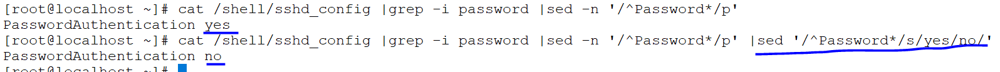
* word committed line # `sed /^Password*/s/^/#/`
 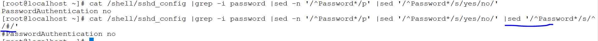
* word un-committed line #  `sed /UseDNS/s/#//`
 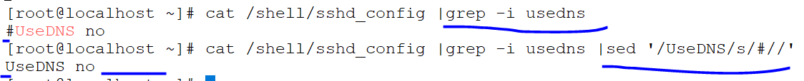

* configuration file `selinux`
 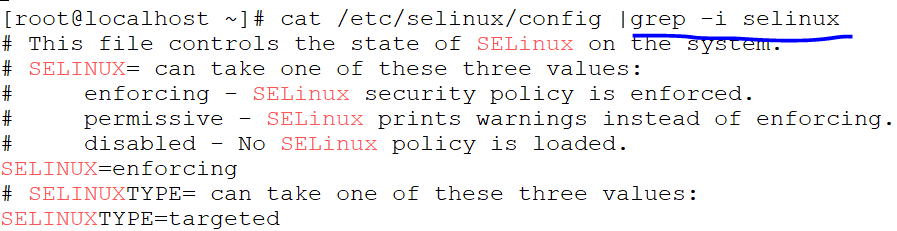 
*   cat /etc/selinux/config |grep -i selinux |sed -n '/^SELINUX*/p'
 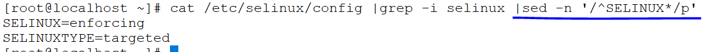
*   `|sed  '/^SELINUX*/s/enforcing/permisive/'`
 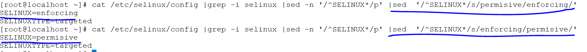

### BOOT ORDER 
*  changing the system boot order timings 
  
  ```
   cat /etc/default/grub |grep -i grub_timeout
  ```
  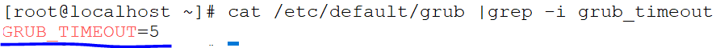
* can change the boot timings
  
  ```
  cat /etc/default/grub |grep -i grub_timeout |sed '/grub_timeout/s/5/10/'
  ```  
  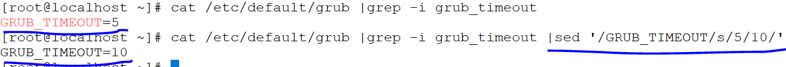
* committed the line
  ```
   cat /etc/default/grub |grep -i grub_timeout |sed '/sed grub_timeout/s/5/10/' ||sed '/GRUB_TIMEOUT/s/^/#/'
  ```
  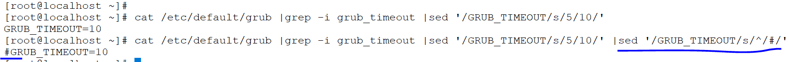  

### changing the names and commited 
 ```
 cat /etc/password |grep -i preethi |sed '/preethi/s/preethi/arjun/' |sed '/preethi/s/^/#/'
 ```  
 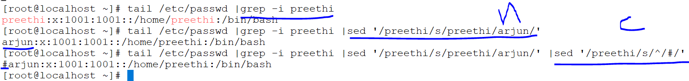
* can also cut the based columns by using `sed-command`
  ```
   cat /etc/passwd |tail -3 |sed 's/preethi/venu/' |sed 's/^/#/' |cut -d: -f1,2,4
  ``` 
  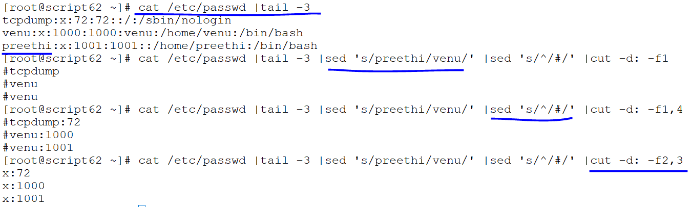