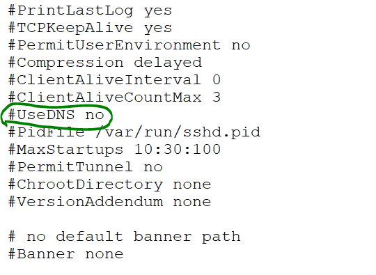
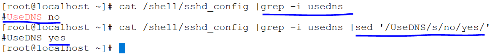

### SED COMMAND:

* to print line number from a file by using `sed` command
  ```
  cat -n /etc/passwd |sed -n '10,15 p'
  ```
  
* to print odd numbers in a file
  ```
  cat -n /etc/passwd |head -10 |sed -n '/1~2 p'
  ```  
  
* to print even numbers from a file   
  ```
  cat -n /etc/passwd |head -10 |sed -n '2~2 p'
  ```
  
* to delete a lines from a file
  ```
  cat -n /etc/passwd |head -10 |sed '2 d'
  cat -n /etc/passwd |head -10 |sed '2 d'
  ```  
  
* to delete a 2nd to last line 
  ```
  cat -n /etc/passwd |head -10 |sed '2 $d'
  ```  
  
* to delete a word in file
  ```
  cat -n /etc/passwd |tail -10 |sed '/jonny/ d'
  ```  
  
* to change the name old-name to new-name
  ```
  cat -n /etc/passwd |tail -10 |sed 's/jonny/venu/'
  ```  
  
* if a word capital/small letters
  ```
  echo apple ant |sed -e 's/A/a/g'
  ```
* to change the name whole file as a same name
  
*  
  
* to remove the password prompting
  ```
  sed -n '/^Password*/p' //out2/sshd_config
  sed '/^Password*/yes/no/' /out2/sshd_config |grep ^Password
  ```  
  

*   uncomment the line in a configure files
*  comment the line in a configure file
  ```
   cat -n /out2/sshd_config |grep -i usedns |sed 's/#//'
   cat -n /etc/ssh/sshd_config  |grep -i usedns |sed 's/^#//'
  ```    
  
  
