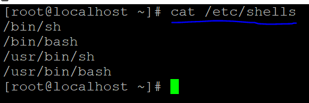
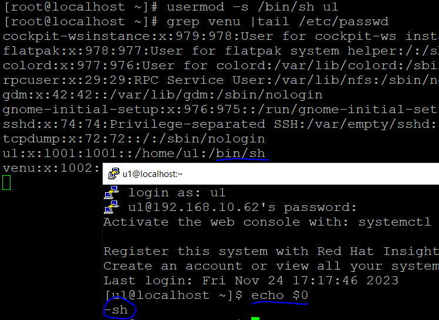
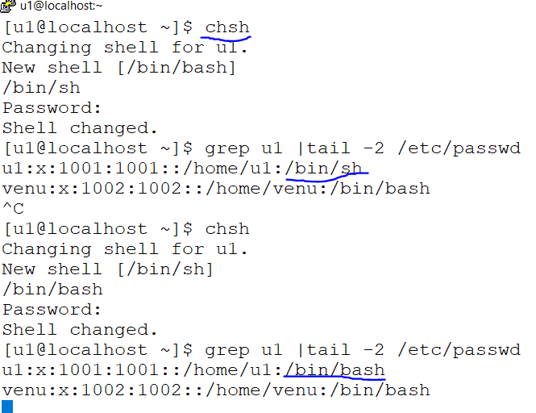
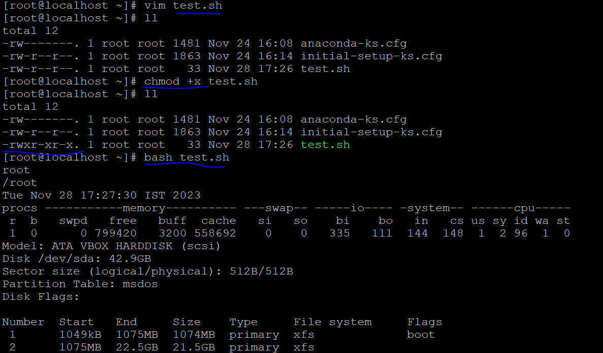
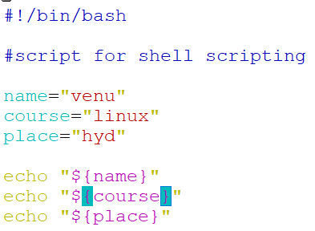
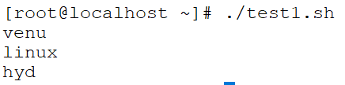
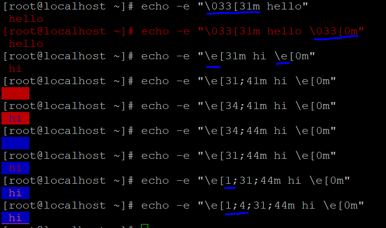

## SHELL SCRIPTING

#### INTRODUCTION

* Shell script runs under bash shell
* To check currently which shell are using
 ```
 [root@localhost ~]# echo $SHELL
/bin/bash 
 ``` 
* To check how many shells are availble in terminal
  ```
  cat /etc/shells
  ```
  

* To change the shell as a `root_user` to normal `user`
 
  ```
  grep -i user_name |tail /etc/passwd
  usermod -s /bin/sh user_name
  usermod -s /bin/bash user_name
  ```
* as a user login into default shell `/bin/bash/`
* as a user can't login without `bash shell`
  .example:usermod -s /bin/csh <user_name>  
* Check which type of shell currently are used we can run it as  
 ```
 echo $SHELL
 echo $0
 ```
 
* normal user can also the change shell `chsh` & `passwd` for the login user

* grep u1 |tail -2 /etc/passwd 
* echo $0
 

* sample script
  ```
  vim tesh.sh
   who
   pwd
   date
   parted -l
   wq!
  ``` 
* chmod +x tesh.sh
  bash test.sh
  sh test.sh
  ./test.sh
  

### SHEBANG (#!) #SHARP !BANG

*  .Comment `cannot see the information with execute script`
   .uncomment `can only see the information with execute script`

```
#! /bin/bash
#! /bin/perl
#! /bin/python
``` 

  
  ```
  chmod +x test1.sh
  ./test1.sh
  as root user we can run the script directly bash,sh
  ```
  

* ### ECHO Command
  `echo` command printing the message
   e escape sequnce
   n new line
   t tab space
  ```
   [root@localhost ~]# echo hello
     hello
     [root@localhost ~]# echo -n hello
     hello[root@localhost ~]# echo -e "hello\nhi"
     hello
     hi
     [root@localhost ~]# echo -e "name\tcourse\tmobile"
     name    course  mobile
     
  ```
* colouring the outputs
  ```
  -e:escape sequence
  \033:enable colour code
  \e:enable colour code
  ```
 


