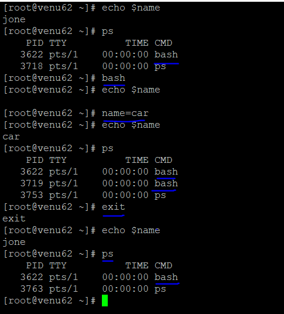
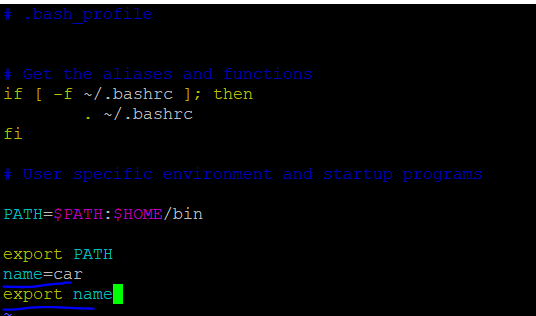
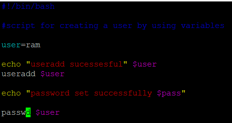
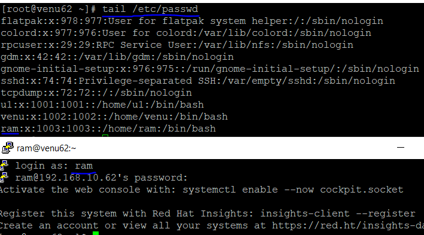
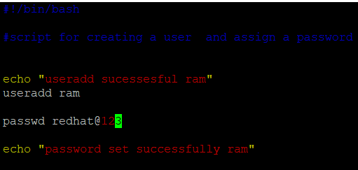
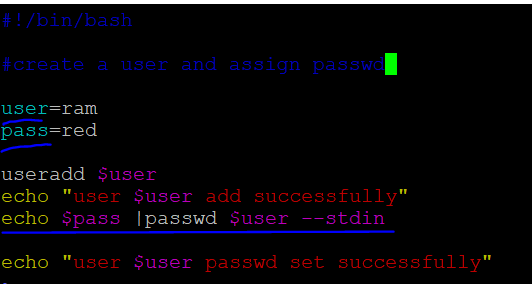

### VARIABLES:
* variables starts with letters and not starts with numbers
  ```
  ram
  ram123
  ram_123
  ram_var
  ```
* properties:
  
  ```
  ro
  rw
  local
  global
  export-->local
  ```
* create a environmental variables for temporary
  
  ```
  .name=car
  echo $car
  .bash
  echo $car
  ```
 * if system restarts current variables can be lost 

   

* create a environmental variable permanently
  
* ls -a

  .bashrc
  .bash_profile

* vim .bash_profile

  

* create a user and assign password it's own 

*  vim test1.sh 
  
  ```
  #!/bin/bash

  #script for creating a user by using variables
  
  user=ram
  
  echo "useradd sucessesful" $user
  useradd $user
  
  echo "password set successfully $pass"
  
  passwd $user
  .wq!
  .chmod +x test1.sh
  ./test1.sh
  ```
  
  

*  create a user and assign password automatically
* vim test2.sh  
  ```
  #!/bin/bash

  #script for creating a user  and assign a password
  
   echo "useradd sucessesful ram"
   useradd ram
   
   passwd redhat@123
   
   echo "password set successfully ram"
  .wq!
  .chmod +x test1.sh
  ./test2.sh
  ```
     

* changing the password for single attempt

* passwd --help

  
* --stdin  read new tokens from stdin (root only)
* echo <passwd_name>|passwd <user_name> --stdin 

* echo red |passwd ram --stdin

* Changing password for user ram.
* passwd: all authentication tokens updated successfully.
  
* vim test3.sh

  ```
  #!/bin/bash

   #create a user and assign password  by using --stdin
   
   user=ram
   pass=red
   
   useradd $user
   echo "user $user add successfully"
   echo $pass |passwd $user --stdin
   
   echo "user $user passwd set successfully"

   .wq!
  .chmod +x test1.sh
  ./test3.sh
  
  ```    
  

*  command substitution
   ```
   john=`date`
   echo $john
   john=$(ps)
   echo $john
   john=$(uptime)
   echo $john
   ```

### md5sum:message digit 5sum

  date |md5sum |cut -c 1-5

* script for md5sum  
 
 ```    
 #!/bin/bash
  #script for using md5sum
  
  user=arjun
  
  echo "user add successful $user"
  useradd $user
  pass=`date|md5sum|cut -c 1-5`
  echo $pass|passwd $user --stdin
  
  echo -e "user=$user\npasswd=$pass" 
  ```
* ARTHMATIC SUBSTITUATIONS:

 ```
 echo 10+5
 echo $((10+5))
 echo $((10-5))
 echo $((10*5))
 a=5
 b=10
 echo $(($a+$b))
 echo $(($a-$b))
 echo $(($a*$b))  
 ```
* script for calculate total memory for `free -m`
* vim script01.sh

 ```
  #!/bin/bash
#script for cal percentage by using function

TOTAL=`free -m |awk '/Mem/ {print $2}'`
USED=`free -m |awk '/Mem/ {print $3}'`
FREE=`free - m|awk '/Mem/ {print $4}'`

echo "Total Mem = $TOTAL MB"
echo "Used Mem = $(($USED*100/$TOTAL)) %"
echo "Free Mem = $(($FREE*100/$TOTAL)) %"
=========================================
Total Mem = 1812 MB
Used Mem = 27 %
Free Mem = 42668 %
 ```


  